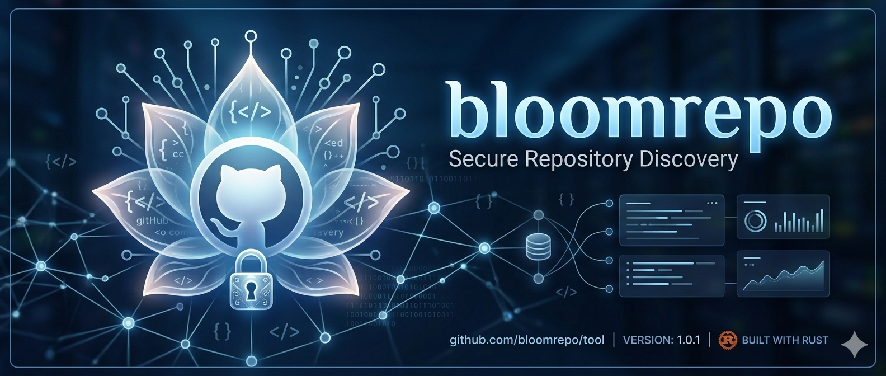
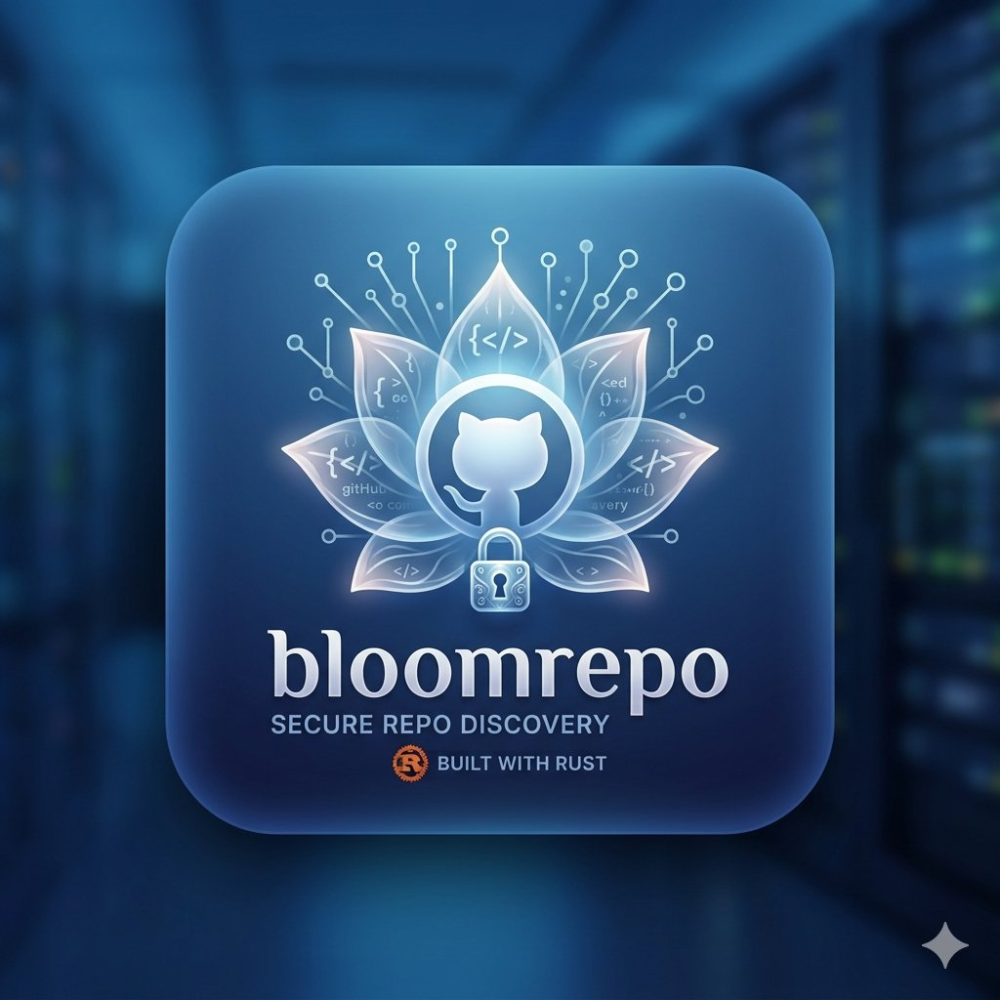

<p align="center">
  
</p>

<h1 align="center">
  
  BloomRepo
</h1>

<p align="center">
  <strong>A reliable, high-performance GitHub repository discovery and monitoring engine built in Rust.</strong>
</p>

<p align="center">
  <a href="#key-highlights"></a>
  <a href="#persistent-storage--fts5-search"></a>
  <a href="#desktop-gui-experience"></a>
  <a href="LICENSE"></a>
  <a href="#verification--testing"></a>
</p>

---

## Overview

**BloomRepo** is a local-first, low-overhead intelligence tool designed for discovering, indexing, filtering, and monitoring public GitHub repositories as they are published. Built entirely in native Rust, BloomRepo pairs a high-throughput background engine with both a sleek graphical desktop interface (GUI) and a clean terminal workflow (CLI).

Rather than making unrealistic marketing claims of being an omniscient global firehose, BloomRepo operates with **transparent, honest engineering**: it navigates public GitHub REST API quotas conservatively, maintains isolated stream cursors, enforces persistent deduplication in local SQLite, and dispatches non-blocking notifications across multiple platforms.

---

## Honest Scope & Transparency

To maintain engineering credibility and integrity:

* **API Boundary Truth:** GitHub's public REST APIs enforce hard rate limits (`Core` resource limits are 60 req/hr unauthenticated or 5,000 req/hr with a Personal Access Token; `Search` limits are restricted to 10–30 req/min). Public event streams only expose a moving window of recent public activity.
* **Realistic Coverage:** BloomRepo is a *discovery & monitoring engine*, not an internal GitHub firehose. It captures public activity systematically through three distinct, balanced streams without exhaustively spamming GitHub servers or risking account bans.
* **Guaranteed Deduplication:** Every repository is normalized, evaluated against spam filters, and upserted into SQLite. Repositories already indexed locally never trigger duplicate alerts, log spam, or duplicate JSONL entries.
* **Zero Telemetry / 100% Privacy:** Your tokens, searches, logs, and database remain strictly local on your machine. No analytics or private metrics are transmitted to any third party.

---

## Key Highlights

- **Shared Rust Engine:** A single asynchronous core powered by Tokio drives both the graphical desktop application (`egui`/`eframe`) and the continuous terminal monitor.
- **Independent Stream Cursors:** Sequential repository pagination, search watermarks, and event ETags maintain isolated progression states—one stream's failure never corrupts another's cursor.
- **Dual Rate-Limit Bucket Tracking:** Separate runtime tracking for `Core` vs `Search` resources per token, automatically respecting `x-ratelimit-remaining`, `x-ratelimit-reset`, and `Retry-After`.
- **Cold-Start Auto-Anchoring:** New installations automatically anchor their sequential cursor to the latest repository on GitHub or your local database, eliminating startup deadlocks.
- **Sanitized FTS5 Full-Text Search:** Built-in SQLite FTS5 search with automatic query sanitization—search complex programming terms like `c++`, `node.js`, or quoted phrases without SQL syntax errors.
- **Persistent Local Storage:** SQLite with Write-Ahead Logging (WAL), normalized schema with triggers, busy-timeout handling, and atomic state saving.
- **Flexible Spam & Priority Filtering:** Filter out spam, auto-generated names, homework templates, and forks. Match user-defined priority keywords across repository names, descriptions, and topics.
- **Multi-Channel Dispatcher:** Native Windows Toast notifications (isolated UTF-16LE Base64 execution), Discord Webhooks, Telegram Bots, and generic HTTP Webhooks.

---

## Architecture

```text
                               GitHub Public REST API
                                         │
        ┌────────────────────────────────┼────────────────────────────────┐
        ▼                                ▼                                ▼
  [Sequential Stream]             [Events Stream]                  [Search Stream]
  Link: rel="next" traversal      ETag-aware best-effort          Interval-controlled
  Independent cursor              freshness layer                  lookback query
        │                                │                                │
        └────────────────────────────────┼────────────────────────────────┘
                                         ▼
                             Normalization & Sanitization
                                         │
                                         ▼
                            Rule-Based Filtering Engine
                          (Spam / Language / Forks / Tags)
                                         │
                                         ▼
                             Persistent Deduplication
                            (Local SQLite ID Matcher)
                                         │
                                         ▼
                             SQLite Transaction (WAL)
                        ┌────────────────┴────────────────┐
                        ▼                                 ▼
                 FTS5 Index Triggers              Atomic Output Pipeline
                  (AI / AD / AU)                 (Log / JSONL / Alerts)
                        │                                 │
                        ▼                                 ▼
             Desktop GUI / CLI Search            Multi-Channel Alerts
             (Instant Interactive UI)           (Toast / Discord / TG)
```

---

## Source Streams Explained

1. **Sequential Listing Stream (`/repositories?since=...`)**  
   Provides broad sequential traversal. Its cursor advances only upon verified transaction commits and strictly follows GitHub's `Link: rel="next"` response headers.
2. **Events Polling Stream (`/events`)**  
   Captures immediate freshness from public `CreateEvent` notifications. Uses HTTP conditional requests (`ETag` / `If-None-Match`) to save quota when no new events have occurred.
3. **Search Stream (`/search/repositories?q=created:>...`)**  
   Discovers recently published repositories matching configured search lookback intervals. Operates in an isolated throttled bucket to safeguard Search API rate limits.

---

## Desktop GUI Experience

The desktop interface is built using `eframe` and `egui`, providing:

* **Visual Identity & Icon:** Features an embedded custom application icon in the window titlebar and UI panels.
* **Real-Time Statistics:** Total repositories indexed, items discovered today, priority alerts, and filtered items.
* **Instant Full-Text Search:** Search thousands of indexed repositories with instant response times, fork toggles, and priority-only filters.
* **Control Actions:** One-click manual scan, pause/resume monitoring, and instant browser opening.
* **Integrated Architect & System Profile:** Discrete, non-intrusive access to developer credentials, security research background, and official contacts directly from the UI.

---

## Requirements

* **Operating System:** Windows 10 or later (native desktop GUI & toast alerts). Linux and macOS support CLI and core engine.
* **Rust:** Stable Rust toolchain (2021 edition).
* **GitHub Token:** A Personal Access Token (PAT) is strongly recommended for standard 5,000 req/hr limits (read-only public access is sufficient).

---

## Quick Start

### 1. Clone the repository

```powershell
git clone https://github.com/okba14/BloomRepo.git
cd BloomRepo
```

### 2. Configure credentials

Copy `.env.example` to `.env` and set your credentials:

```powershell
Copy-Item .env.example .env
notepad .env
```

```dotenv
GITHUB_TOKEN=your_personal_access_token_here
GITHUB_USER_AGENT=BloomRepo/2.1 (+https://github.com/)
GITHUB_TIMEOUT_SECONDS=25

# Optional notification webhooks
DISCORD_WEBHOOK_URL=
TELEGRAM_BOT_TOKEN=
TELEGRAM_CHAT_ID=
WEBHOOK_URL=
```

> **Security Note:** Never commit your `.env` file. The repository `.gitignore` automatically excludes `.env`, `repos.db*`, `_state.json`, and output logs.

### 3. Build & Run

**Build the optimized release binary:**
```powershell
cargo build --release
```

**Launch the Desktop GUI:**
```powershell
.\target\release\bloomrepo.exe --gui
```
*(Or double-click `Run Watcher.bat`)*

**Launch the Terminal CLI Monitor:**
```powershell
.\target\release\bloomrepo.exe --cli
```
*(Or double-click `Run Watcher (Terminal).bat`)*

**Run a single discovery cycle:**
```powershell
.\target\release\bloomrepo.exe --once
```
*(Or double-click `Check Once.bat`)*

---

## Command-Line Interface (CLI)

```text
bloomrepo.exe [OPTIONS]
```

| Flag / Option | Description |
|---|---|
| `--gui` | Launch the native graphical desktop interface (default if no flags). |
| `--cli` | Run the continuous terminal monitor. |
| `--once` | Execute a single scan cycle, persist outputs, and exit cleanly. |
| `--stats` | Query SQLite and print instantaneous database metrics. |
| `--search <query>` | Query the local FTS5 full-text search index (e.g. `--search "c++"`). |
| `--rebuild-fts` | Manually rebuild the SQLite FTS5 search index. |
| `--config <path>` | Specify a custom path to `config.toml` (default: `config.toml`). |

---

## Configuration (`config.toml`)

All non-secret runtime behaviors can be customized:

```toml
[general]
interval_seconds = 30
max_pages_per_cycle = 5
lookback_hours = 3
log_level = "info"
max_concurrent_requests = 4
search_interval_seconds = 60

[auth]
timeout_seconds = 25
user_agent = "BloomRepo/2.1 (+https://github.com/)"

[streams]
enable_sequential_stream = true
enable_events_stream = true
enable_search_stream = true
search_queries = []

[filtering]
enable_spam_filter = true
ignore_forks = true
min_description_length = 0
ignore_name_patterns = [
    "^auto-repo-\\d+",
    "^repo-\\d+$",
    "^test-\\d+$",
    "^homework-"
]
priority_keywords = ["agent", "security", "exploit", "compiler", "kernel"]
allowed_languages = []

[storage]
database_path = "repos.db"
state_path = "_state.json"
enable_wal = true
enable_log_file = true
enable_jsonl_stream = true

[notifications]
enable_windows_toast = true
toast_priority_only = false
timeout_seconds = 10
max_items_per_message = 5
```

---

## Verification & Testing

BloomRepo includes an automated unit testing suite:

```powershell
cargo test
```

Expected output:
```text
running 10 tests
test crawler::tests::test_parse_next_link ... ok
test crawler::tests::test_url_encode ... ok
test notifier::tests::test_base64_encode ... ok
test notifier::tests::test_ps_quote ... ok
test state::tests::legacy_state_file_is_backward_compatible ... ok
test filter::tests::disabled_spam_filter_still_marks_priority ... ok
test db::tests::test_existing_ids ... ok
test db::tests::test_insert_batch_and_get_stats ... ok
test db::tests::test_fts5_sanitization_and_special_chars ... ok
test state::tests::atomic_state_round_trip_preserves_independent_cursors ... ok

test result: ok. 10 passed; 0 failed; 0 ignored; 0 measured; 0 filtered out
```

---

## Lead Architect & Developer

<table align="center">
  <tr>
    <td align="center">
      <br />
      <strong>GUIAR OQBA</strong><br />
      <sub>Systems Software Architect & Cyber Security Researcher</sub>
    </td>
  </tr>
</table>

* 🌐 **Official Website:** [https://guiarx.com/](https://guiarx.com/)
* 📧 **Business & Inquiries:** [contact@guiarx.com](mailto:contact@guiarx.com)
* 📬 **Direct Contact:** [hello@guiarx.com](mailto:hello@guiarx.com)

---

## Support & Voluntary Sponsorship

BloomRepo is an independently developed open-source tool. Using the software is 100% free and does not require any contribution. If BloomRepo brings value to your workflow and you wish to support ongoing maintenance and infrastructure:

* **Bitcoin (BTC Network):**  
  `12Kh5tfMYqzNwu7QzNvWQ7yLBeGvBERSq6`

---

## License

Distributed under the [MIT License](LICENSE).  
Copyright © 2026 **GUIAR OQBA**. All rights reserved.
