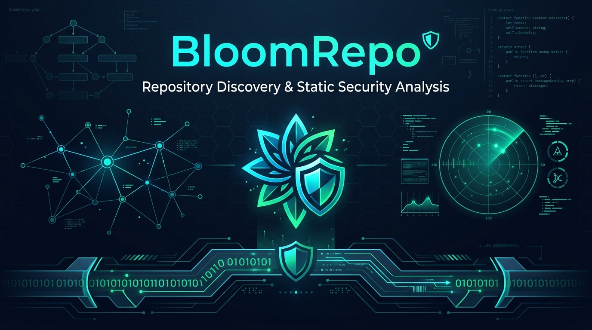

# BloomRepo 3.0



<div align="center">

[](https://crates.io/crates/bloomrepo)
[](https://www.rust-lang.org)
[](LICENSE)
[](#install)
[](#architecture--trust-boundaries)
[](#authorized-analysis)

**Local-first public GitHub repository discovery, monitoring, and authorized local static analysis.**

A unified Rust engine drives both a headless CLI and a native `egui`/`eframe` desktop interface.  
Repository history, field-level change logs, triage decisions, and a transactional notification outbox are stored durably in SQLite.  
**Strictly zero AI services are used.**

</div>

---

## Overview

Most repository discovery tools act as dumb firehoses: they scrape URLs, spam notifications on raw keywords, and drop state during crashes. **BloomRepo 3.0** is built on defensive systems engineering:

- **Reliability First (Transactional Outbox)**: Discovered items, cursor progression, observation history, and notification events commit inside a single atomic SQLite transaction. If a crash or network partition occurs, unhandled deliveries remain persisted with bounded exponential backoff and jitter.
- **Change Intelligence over URL Dumps**: Tracks historical field modifications (releases, licenses, descriptions, archiving) for watched projects rather than alerting only on new names.
- **Explainable Triage**: Replaces arbitrary single-number scores with decoupled metrics: **Relevance** (interest keywords), **Confidence** (metadata completeness), and **Security Importance** (explicitly unassessed at discovery; requires authorized local analysis). Incomplete metadata is deferred for enrichment rather than dropped prematurely.
- **Authorized Defensive Analysis**: Sandboxed, read-only local directory analyzer. Performs bounded dependency inventory (`Cargo.lock`, `package-lock.json`, Python/uv lockfiles), CycloneDX 1.5 JSON SBOM generation, regex secret scrubbing, and opt-in OSV vulnerability queries without executing scanned project code.
- **Fail-Closed Security Boundaries**: Enforces verified public HTTPS endpoints for Webhooks/Discord/Telegram, rejects SSRF and internal IP ranges, blocks redirects, and redacts secrets from database rows and operational logs.

---

## Architecture & Trust Boundaries

```
                    +------------------------------------------+
                    |           GitHub Public API              |
                    |  (/events, /search, /repositories, tags) |
                    +--------------------+---------------------+
                                         |  Fail-Closed HTTP (Pinned, TLS 1.3)
                                         v
+---------------------------------------------------------------------------------+
|                                 BloomRepo Engine                                |
|                                                                                 |
|   +-------------------+    +--------------------+    +----------------------+   |
|   |   GithubCrawler   |--->|     RepoFilter     |--->|       Database       |   |
|   | (Token Pool / RL) |    |  (Decision Engine) |    |  (WAL / Trans. Outbox|   |
|   +-------------------+    +--------------------+    +----------+-----------+   |
|                                                                 |               |
|                                          +----------------------+               |
|                                          v                                      |
|                       +------------------------------------+                    |
|                       |        Outbox Dispatcher           |                    |
|                       | (Leasing, Retries, Idempotent Key) |                    |
|                       +------------------+-----------------+                    |
+------------------------------------------|--------------------------------------+
                                           |
               +---------------------------+---------------------------+
               v                           v                           v
     +-------------------+       +-------------------+       +-------------------+
     | Local File Shards |       | Desktop Toasts    |       | Secure Webhooks   |
     | (YYYY-MM/*.jsonl) |       | (PowerShell / OS) |       | (Discord/Telegram)|
     +-------------------+       +-------------------+       +-------------------+
```

---

## Workspaces (Desktop GUI)

| Workspace | Description & Available Operations |
| :--- | :--- |
| **Overview** | Real-time discovery metrics, active source telemetry, manual scan triggering, and quick triage review shortcuts. |
| **Discover** | Paginated local search with filters for priority, forks, rejected items, and review status. Displays full transparent assessment reasons and missing evidence. |
| **Watchlist** | Dedicated view of stored watched repositories with observed field-level change history (`changes` audit log). |
| **Security** | Bounded local static directory scanner: dependency inventory, CycloneDX 1.5 JSON exports, OSV vulnerability checks, and secret finding summaries. |
| **Health** | Live operational status for each ingestion stream (events, search, sequential, enrichment, watch), outbox pending/failed counts, and manual delivery retry. |
| **Settings** | Redacted configuration viewer, channel connectivity checks, rule re-evaluation, and live online SQLite database backups. |

---

## Installation

### Option 1: Instant Install via Cargo (Recommended)

BloomRepo is published on [crates.io](https://crates.io/crates/bloomrepo). Install the latest release directly with a single command:

```bash
cargo install bloomrepo
```

Verify the installation:
```bash
bloomrepo --help
```

---

### Option 2: Build from Source

#### Requirements
- [Rust](https://rustup.rs/) **1.89 or newer** (uses `std::fs::File::try_lock` for cross-process instance locking).
- **Windows**: Windows 10/11 x64 or ARM64.
- **Linux**: x86_64 or aarch64 (Kernel 5.6+ with `procfs` for secure local directory traversal; native graphics libraries for GUI mode).
- SQLite is bundled and compiled statically.

#### Compilation

```powershell
# Clone the repository
git clone git@github.com:okba14/BloomRepo.git
cd BloomRepo

# Setup toolchain
rustup toolchain install stable --profile minimal
rustup component add rustfmt clippy --toolchain stable

# Configure environment overrides
Copy-Item .env.example .env

# Build optimized release binary
cargo build --release --locked

# Validate installation
.\target\release\bloomrepo.exe --validate-config
.\target\release\bloomrepo.exe --help
```

On Linux:
```bash
cp .env.example .env
cargo build --release --locked
./target/release/bloomrepo --validate-config
./target/release/bloomrepo --help
```

---

## CLI Reference

```text
bloomrepo [--config PATH] [ACTION]
```

| Action | Behavior & Guarantees |
| :--- | :--- |
| `--gui` | Open the desktop GUI application (default when no action is passed). |
| `--cli`, `--terminal` | Run discovery and background outbox dispatcher continuously in the terminal. |
| `--once` | Execute exactly one discovery cycle and one outbox delivery pass. Exits non-zero on operation errors. |
| `--validate-config` | Offline validation of `config.toml`; contacts no remote hosts and opens no database. |
| `--stats` | Display repository totals, priority counts, and discovery figures from local SQLite storage. |
| `--health` | Report per-source status (healthy, rate-limited, catching up), outbox backlog, and observations. |
| `--search QUERY` | Query the local SQLite FTS5 index (capped at 50 results). |
| `--rebuild-fts` | Rebuild and optimize the local full-text search table. |
| `--watch OWNER/REPO` | Enable change and release tag tracking for a stored repository. |
| `--unwatch OWNER/REPO`| Disable watch tracking for a stored repository. |
| `--review OWNER/REPO STATE` | Set triage status: `new`, `important`, `needs_review`, `ignored`, or `resolved`. |
| `--reevaluate` | Re-run current configuration rules across all stored repositories without contacting GitHub. |
| `--retry-notifications` | Requeue failed outbox events and run a single delivery pass. |
| `--backup PATH` | Create a consistent online SQLite backup; never overwrites an existing file. |
| `--analyze PATH --authorized` | Run bounded local static analysis on an authorized directory (read-only, offline by default). |
| `--osv` | *(With `--analyze` only)* Opt into remote dependency vulnerability queries to OSV. |
| `--report PATH`, `--sbom PATH` | *(With `--analyze` only)* Export Markdown summary and CycloneDX 1.5 JSON to new files. |

### CLI Usage Examples

```powershell
# Run a single discovery pass with custom config
.\target\release\bloomrepo.exe --config config.toml --once

# Search local database for Rust security tools
.\target\release\bloomrepo.exe --search "rust security"

# Add a discovered project to the watchlist and mark as important
.\target\release\bloomrepo.exe --watch "tamnd/kime"
.\target\release\bloomrepo.exe --review "tamnd/kime" important

# Check operational health and outbox status
.\target\release\bloomrepo.exe --health

# Run authorized offline local analysis and export CycloneDX SBOM
.\target\release\bloomrepo.exe --analyze "C:\Projects\my-app" --authorized --report report.md --sbom sbom.cdx.json

# Run local analysis with explicit OSV vulnerability lookup consent
.\target\release\bloomrepo.exe --analyze "C:\Projects\my-app" --authorized --osv
```

---

## Authorized Local Static Analysis

BloomRepo provides safe, read-only static analysis for directories you own or are authorized to inspect.

- **Non-Execution Invariant**: Does not invoke `git`, execute repository hooks, install dependencies, or trigger package manager scripts.
- **Filesystem Traversal Bounds**:
  - Maximum 10,000 files, 30,000 directory entries, depth 24.
  - File size capped at 1 MiB per file; 50 MiB total data budget.
  - 20-second cooperative timeout.
  - Skips symlinks, junctions, reparse points, non-regular files, hard-linked regular files, and `.git` trees.
- **Dependency Inventory**: Parses lockfiles for exact dependencies:
  - Rust: `Cargo.lock`
  - JavaScript / TypeScript: `package-lock.json`, `pnpm-lock.yaml`
  - Python: `requirements.txt` (pinned exact versions), `poetry.lock`, `uv.lock`
  - CycloneDX / SPDX JSON standard imports.
- **Secret Detection with Redaction**: Recognizes patterns for AWS Access Keys, GitHub Personal Access Tokens, and PEM private keys. Matching secret values and source code snippets are **never stored in the database or exported in reports**.
- **OSV Disclosures**: Supplying `--osv` sends validated dependency **names, versions, and ecosystems** to `https://api.osv.dev/v1/query`. Scanned source code and local file paths are **never** transmitted.

---

## Configuration & Environment Overrides

`config.toml` contains clean defaults without credentials. Sensitive tokens are loaded strictly from the process environment or a `.env` file **placed beside the selected configuration file**.

Supported environment overrides:
- `GITHUB_TOKEN` / `GITHUB_TOKENS`: Single or comma-separated GitHub personal access tokens.
- `DISCORD_WEBHOOK_URL`: Discord webhook endpoint (must be public HTTPS).
- `TELEGRAM_BOT_TOKEN` & `TELEGRAM_CHAT_ID`: Telegram bot credentials.
- `CUSTOM_WEBHOOK_URL`: Custom HTTP outbox receiver (includes `Idempotency-Key` header).
- `ENABLE_WINDOWS_TOAST`: `true` or `false` (Windows toast alerts).

See [`.env.example`](.env.example) for a full template.

---

## Verification & Testing

BloomRepo maintains strict automated test coverage across database migrations, outbox dispatching, path sandboxing, and parsing boundaries.

```powershell
# Format check
cargo fmt --all -- --check

# Strict compilation & clippy verification
cargo check --all-targets --all-features --locked
cargo clippy --all-targets --all-features --locked -- -D warnings

# Execute test suite (107 tests)
cargo test --all --all-features --locked
```

---

## Author & License

Created by **GUIAR OQBA**, Systems Software Architect & Cyber Security Researcher.

- **Website**: [guiarx.com](https://guiarx.com/)
- **Business**: [contact@guiarx.com](mailto:contact@guiarx.com)
- **Direct contact**: [hello@guiarx.com](mailto:hello@guiarx.com)
- **Optional Support (BTC)**: `12Kh5tfMYqzNwu7QzNvWQ7yLBeGvBERSq6`

Distributed under the [MIT License](LICENSE). Copyright (c) 2026 GUIAR OQBA.
